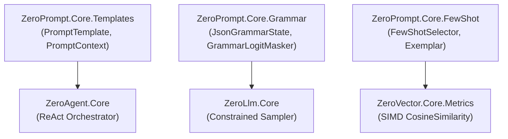

# 🎯 ZeroPrompt: Sovereign Pure C# Prompt Templating & Grammar-Constrained Engine

[](LICENSE)
[](https://dotnet.microsoft.com/)
[-brightgreen.svg)]()

**ZeroPrompt** is an industrial-grade, zero-allocation prompt templating, Pushdown Automaton (PDA) JSON Grammar state machine, Grammar-Constrained Logit Masker, and dynamic few-shot exemplar selector written in 100% pure C#. It operates at **Tier 5 (Presentation & Orchestration)** of the [ZeroPlatform](https://github.com/kzxl/ZeroPlatform) ecosystem.

---

## ⚡ Key Capabilities

- **Zero-Allocation Prompt Templating (`PromptTemplate`)**:
  - Blazing-fast variable interpolation syntax `{{variable_name}}` without heavyweight regex or runtime reflection.
  - Span-based rendering directly into `StringBuilder` buffers.
  - Parameter validation and missing variable tracking.
- **Pushdown Automaton (PDA) JSON Grammar Engine (`JsonGrammarState`)**:
  - Microsecond deterministic stack-based validation of LLM generation streams.
  - Tracks nested objects (`{`), arrays (`[`), string literals, escape sequences, colons, and commas.
  - Evaluates allowable next character classes (e.g. `AllowOpenBrace`, `AllowPropertyName`, `AllowColon`, `AllowValue`, `AllowComma`).
- **Grammar-Constrained Logit Masking (`GrammarLogitMasker`)**:
  - Dynamically masks out non-conforming tokens during autoregressive decoding (`-Infinity` for invalid tokens).
  - Guarantees 100% syntactically valid JSON outputs from local LLMs (`ZeroLlm`) or remote endpoints, eliminating JSON parse hallucinations in tool-calling workflows.
- **Dynamic Few-Shot Exemplar Selector (`FewShotSelector`)**:
  - Backed by `ZeroVector.Core` hardware-accelerated SIMD vector similarity (`VectorMetrics.CosineSimilarity`).
  - Dynamically picks top-$K$ most semantically relevant few-shot input/output demonstrations for prompts.
- **Zero External Dependencies & Multi-Targeting**:
  - Compatible with `.NET 8.0+`, `.NET Framework 4.6.2+`, and `.NET Standard 2.0`.

---

## 🚀 Quick Start

### 1. Template Rendering

```csharp
using ZeroPrompt.Core.Templates;

var template = new PromptTemplate("You are a SCADA diagnostic engineer for line {{line_id}}. Analyze status: {{status}}.");
var context = new PromptContext()
    .Set("line_id", "LINE-04")
    .Set("status", "OVERHEAT_ALARM");

string prompt = template.Render(context);
Console.WriteLine(prompt);
```

### 2. JSON Grammar State Machine

```csharp
using ZeroPrompt.Core.Grammar;

var grammar = new JsonGrammarState();

// Feed tokens as they are sampled from LLM
grammar.Feed("{\"tool\": \"read_register\", \"args\": {\"address\": 40001}}");

if (grammar.IsCompleted)
{
    Console.WriteLine("Valid JSON payload generated!");
}
```

### 3. Grammar-Constrained Logit Masking

```csharp
using ZeroPrompt.Core.Grammar;

var masker = new GrammarLogitMasker();
var grammar = new JsonGrammarState();
grammar.Feed("{\"status\": ");

float[] logits = new float[vocabSize];
string[] vocab = GetVocabularyTokens();

// Masks out tokens that violate JSON syntax rules
masker.ApplyMask(grammar, logits, vocab);
```

### 4. Semantic Few-Shot Exemplar Selection

```csharp
using ZeroPrompt.Core.FewShot;

var selector = new FewShotSelector();
selector.Add(new Exemplar("Read PLC register 100", "{\"tool\":\"read_plc\",\"reg\":100}", embedding1));
selector.Add(new Exemplar("Query temperature sensor", "{\"tool\":\"get_temp\",\"id\":1}", embedding2));

string demonstrationPrompt = selector.BuildDemonstrationPrompt(queryEmbedding, k: 1);
```

---

## 🛡️ Architecture & Tier Compliance



## 📄 License

MIT License. Engineered with pride for sovereign autonomous computing.
