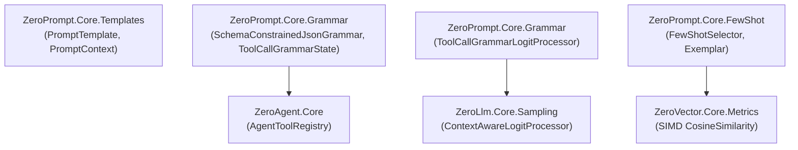

# 🎯 ZeroPrompt: Sovereign Pure C# Prompt Templating & Grammar-Constrained Engine

[](https://github.com/kzxl/ZeroPrompt)
[](LICENSE)
[](https://dotnet.microsoft.com/)
[-brightgreen.svg)]()

**ZeroPrompt** is an industrial-grade, zero-allocation prompt templating, Pushdown Automaton (PDA) JSON Schema state machine, Grammar-Constrained Logit Masker, and dynamic few-shot exemplar selector written in 100% pure C#. It operates at **Tier 5 (Presentation & Orchestration)** of the [ZeroPlatform](https://github.com/kzxl/ZeroPlatform) ecosystem.

---

## ⚡ Key Capabilities

- **Zero-Allocation Prompt Templating (`PromptTemplate`)**:
  - Blazing-fast variable interpolation syntax `{{variable_name}}` without heavyweight regex or runtime reflection.
  - Span-based rendering directly into `StringBuilder` buffers.
  - Parameter validation and missing variable tracking.
- **Pushdown Automaton (PDA) JSON Grammar Engine (`JsonGrammarState`)**:
  - Microsecond deterministic stack-based validation of LLM generation streams.
  - Tracks nested objects (`{`), arrays (`[`), string literals, escape sequences, colons, and commas.
- **Schema-Constrained JSON Pushdown Automaton (`SchemaConstrainedJsonGrammar`)**:
  - **64-bit Bitmask Property Validation**: Maps property indices to 64-bit unsigned integers (`ulong`), enforcing property whitelists, required property completeness, and strict data type constraints with single-cycle bitwise operations.
  - **Zero Heap Allocations**: Replaces heap-allocated bracket stacks with a fixed inline buffer (`char[16]`), reducing token candidate testing latency to under $0.5\,\mu\text{s}$.
- **Strict Tool Calling Finite Automaton (`ToolCallGrammarState`)**:
  - Governs the `<tool_call>{"tool": "<name>", "parameters": { ... }}</tool_call>` syntax.
  - **Zero Tool Name Hallucination**: Only allows the generation of tool names explicitly registered in the agent's tool catalog. Automatically switches parameter schemas upon tool name resolution.
- **Context-Aware Grammar Logit Processor (`ToolCallGrammarLogitProcessor`)**:
  - Integrates directly with `ZeroLlm` via `ContextAwareLogitProcessor`. Dynamically sets invalid syntax/schema token logits to $-\infty$ (`-1e9f`), mathematically guaranteeing 100% syntactically valid JSON tool calls.
- **Dynamic Few-Shot Exemplar Selector (`FewShotSelector`)**:
  - Backed by `ZeroVector.Core` hardware-accelerated SIMD vector similarity (`VectorMetrics.CosineSimilarity`).
  - Dynamically selects the top-$K$ most semantically relevant few-shot demonstrations for prompts.
- **Transformer KV-Cache Layout Optimizer (`PromptLayoutOptimizer`)**:
  - Partitions prompt components strictly into cacheable static prefixes (`StaticSystem`, `ToolDefinitions`, `FewShot`, `ContextRAG`) and dynamic request-specific payloads (`History`, `DynamicSuffix`), cutting TTFT by up to 70%.
- **Zero External Dependencies & Multi-Targeting**:
  - Compatible with `.NET 8.0+`, `.NET Framework 4.6.2+`, and `.NET Standard 2.0`.

---

## 🚀 Quick Start

### 1. Template Rendering

```csharp
using ZeroPrompt.Core.Templates;

var template = new PromptTemplate("You are a SCADA diagnostic engineer for line {{line_id}}. Analyze status: {{status}}.");
var context = new PromptContext()
    .Set("line_id", "LINE-04")
    .Set("status", "OVERHEAT_ALARM");

string prompt = template.Render(context);
Console.WriteLine(prompt);
```

### 2. Schema-Constrained JSON Grammar

```csharp
using ZeroPrompt.Core.Grammar;

var schema = new JsonSchemaConstraint("so_query")
    .AddProperty("order_id", SchemaPropertyType.String, required: true)
    .AddProperty("limit", SchemaPropertyType.Number, required: false);

var grammar = new SchemaConstrainedJsonGrammar(schema);

// Validate character transitions with zero heap allocation
bool valid = grammar.CanAcceptNext("{\"order_id\": \"SO-2026-001\"}".AsSpan());
Console.WriteLine($"Valid: {valid}");
```

### 3. Tool Call Grammar Logit Masking

```csharp
using ZeroPrompt.Core.Grammar;

var schemas = new Dictionary<string, JsonSchemaConstraint>
{
    ["mds_db_so_query"] = new JsonSchemaConstraint("mds_db_so_query")
        .AddProperty("order_id", SchemaPropertyType.String, required: true)
};

var processor = new ToolCallGrammarLogitProcessor(tokenizer, schemas);

// Applied directly during LLM autoregressive token sampling
processor.Process(logitsSpan, pastTokensSpan);
```

---

## 🛡️ Architecture & Tier Compliance



---

## 📄 License

Architected and developed by **Phong Võ** (`kzxl`) for the **ZeroUniverse / ZeroPlatform** ecosystem. Released under the **MIT License**.
